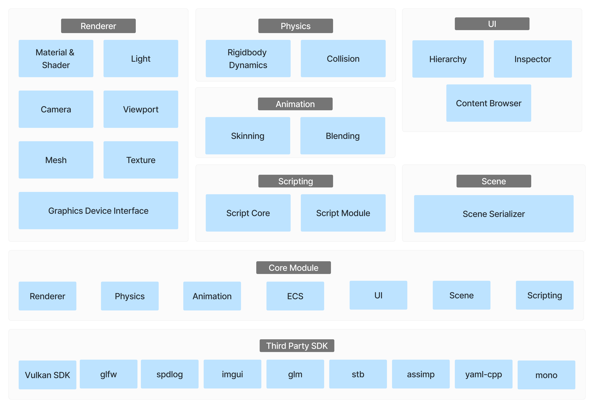

# ALEngine
This is an GAME ENGINE made by 42 Very-Real-Engine Team.

### 🔗 Engine Preview
- [ALERenderer](https://www.youtube.com/watch?v=cwIg2w3mOJ0)
- [ALEPhysics](https://youtu.be/oJnp3A-QEsE)
- [ALEAnimation](https://youtu.be/M6dmDZbce60)


### Table of Contents
1. [Introduction](#1-introduction)
2. [Core Features](#2-core-features)
3. [Project Structure](#3-project-structure)
4. [Setup and Requirements](#4-setup-and-requirements)
5. [Running the Project](#5-running-the-project)
6. [Documentation](#6-documentation)

---

## 1. Introduction
AfterLife Engine 프로젝트는 **Vulkan API를 활용한 게임 엔진 개발 과제**를 수행하기 위해 만들어졌습니다. 이 프로젝트는 최신 그래픽 기술을 활용한 3D 렌더링, 물리 시뮬레이션, 애니메이션 시스템을 포함하고 있으며, 직관적인 **에디터(Editor)** 를 통해 쉽게 조작할 수 있습니다.

---

## 2. Core Features
- **Renderer**: Vulkan API를 이용하여 최적화된 3D 그래픽 렌더링
- **Physics Engine**: 충돌 감지 및 반응, 중력, 마찰 등의 물리 연산
- **Animator**: Skeletal Animation 및 Keyframe Animation 지원
- **Editor**: ImGui 기반의 직관적인 UI를 제공하여, 엔진 기능을 쉽게 조작 가능

---

## 3. Project Structure


---

## 4. Setup and Requirements
### 시스템 요구사항
- **운영 체제**: Windows 10 이상
- **개발 도구**: Visual Studio (최소 2019 버전)
- **Vulkan SDK**: 최신 버전 설치 필수
- **CMake**: 프로젝트 빌드를 위해 설치 필수
- **Git**: 프로젝트 클론을 위해 설치 필수

### 환경 설정
1. **Vulkan SDK 설치**
   - [Vulkan SDK 공식 사이트](https://vulkan.lunarg.com/sdk/home)에서 최신 버전 다운로드 및 설치
   - `VULKAN_SDK` 환경 변수가 설정되어 있는지 확인

2. **Visual Studio 설정**
   - C++ 개발 도구가 포함된 Visual Studio 2019 이상이 설치되어 있어야 합니다.
   - `CMake`가 올바르게 설정되어 있는지 확인

3. **Git 저장소 클론**
   ```bash
   git clone https://github.com/Very-Real-Engine/ALEngine.git
   cd ALEngine
   ```

---

## 5. Running the Project
### 빌드 및 실행 방법
```bash
make
./Sandbox_release.exe ./projects/AfterLifet.alproj
```

위의 명령어를 실행하면 프로젝트가 정상적으로 빌드되고 실행됩니다.

---

## 6. Documentation
각 기능별 설명은 별도의 `.md` 문서로 제공됩니다.
- [Engine 설명](./docs/GameEngine.md)
- [Renderer 설명](./docs/Renderer.md)
- [Physics Engine 설명](./docs/PhysicsEngine.md)
- [Animator 설명](./docs/Animator.md)

Doxygen을 사용하여 자동화된 API 문서도 제공할 예정입니다.

---
